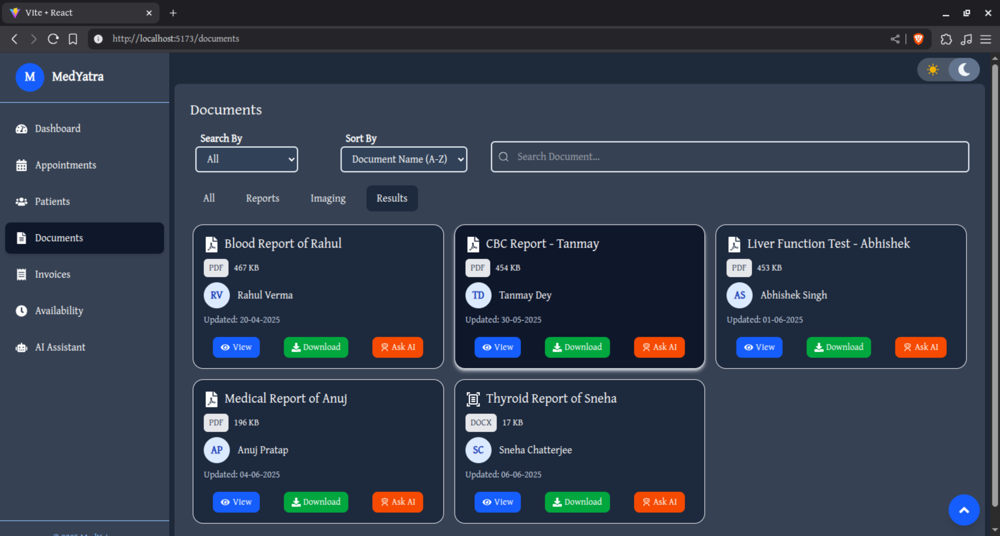

# MedYatra Doctor Dashboard - Documents Section

A responsive, custom-built doctor dashboard for managing patient documents, developed using **Vite** and **TailwindCSS**. This project focuses on the **Documents** section, featuring dynamic document listing with search, filtering, sorting, and interactive UI components.

---

## 🚀 Project Overview

MedYatra Doctor Dashboard is a sleek, modern interface designed to help healthcare professionals efficiently manage and access patient-related documents such as lab results, imaging reports, and prescriptions. This repository showcases a fully custom UI built with TailwindCSS and React, optimized for performance and usability.

---

## 🛠️ Technology Stack

- **React 18** (with functional components and hooks)  
- **Vite** — for fast development and build tooling  
- **TailwindCSS** — for utility-first styling and responsive design  
- **JavaScript (ES6+)**
- **GSAP** - for animations
- **React Icons** - for icons

---

## 📋 Features

- Document listing with:  
  - Search by name or keyword  
  - Sorting by latest or oldest date  
  - Category tabs for filtering document types (Lab Results, Imaging, Prescriptions, etc.)  
- Document cards showing:  
  - Document name and type (PDF, DOCX, etc.)  
  - Patient name and avatar  
  - Timestamp and actionable buttons (View, Download, Ask AI)  
- Responsive layout for mobile, tablet, and desktop  
- Smooth hover and card expansion animations using TailwindCSS utilities  

---

## 📦 Installation & Setup

1. **Clone the repository:**

   ```bash
   git clone https://github.com/AakashTiwari-nitp/MedyatraFrontend.git
   cd MedyatraFrontend
   ```

2. **Install dependencies:**

   ```bash
   npm install
   ```

3. **Run the development server:**

   ```bash
   npm run dev
   ```

4. Open [http://localhost:5173](http://localhost:5173) in your browser to view the dashboard.

---

## 👨‍💻 Author

**Aakash Tiwari**   
[LinkedIn](https://www.linkedin.com/in/aakash-tiwari-in/) | [GitHub](https://github.com/AakashTiwari-nitp/)

---

## 📷 Screenshots





Drive Link of Screen Recordings: [Link](https://drive.google.com/drive/folders/1lQCL_6nYXUsJQLV1h2Q1augQNBkKxgYl?usp=sharing)
---